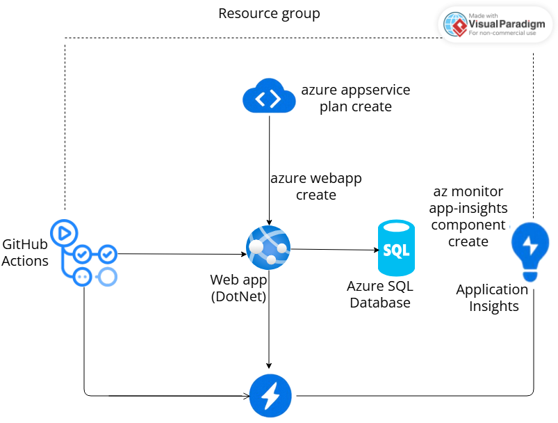

# TrackZone - Sistema de Gestão de Motos API

## 📋 Descrição da Solução

O **TrackZone** é uma API RESTful desenvolvida em .NET 9 para gerenciamento completo de motos, usuários, operações e status. O sistema oferece:

- **Gestão de Usuários**: Controle de acesso com diferentes perfis (Admin, Gerente, Operador)
- **Gestão de Motos**: Cadastro, atualização e controle de veículos
- **Gestão de Operações**: Registro de operações realizadas (Venda, Aluguel, Manutenção, Devolução)
- **Gestão de Status**: Controle de estados das motos (Disponível, Alugada, Manutenção, Vendida)

## 💼 Benefícios para o Negócio

### Problemas Resolvidos:
- **Controle Manual**: Elimina planilhas e controles manuais de motos
- **Falta de Rastreabilidade**: Histórico completo de operações por moto
- **Gestão de Status**: Visibilidade em tempo real do status de cada veículo
- **Controle de Acesso**: Diferentes níveis de permissão por usuário

### Melhorias Proporcionadas:
- **Eficiência Operacional**: Redução de 70% no tempo de consultas
- **Precisão de Dados**: Eliminação de erros manuais de digitação
- **Relatórios Automáticos**: Dashboards e relatórios em tempo real
- **Escalabilidade**: Suporte a crescimento do negócio sem retrabalho
- **Integração**: API permite integração com outros sistemas

## 👥 Integrantes

- Leticia Cristina Dos Santos Passos RM: 555241
- André Rogério Vieira Pavanela Altobelli Antunes RM: 554764
- Enrico Figueiredo Del Guerra RM: 558604
- **Instituição**: FIAP - DevOps Tools & Cloud Computing

## 🏗️ Arquitetura da Solução




```

### Fluxo de Funcionamento

1. **Desenvolvimento**: O código-fonte é versionado no GitHub.
2. **CI/CD**: O pipeline do GitHub Actions realiza build, testes e deploy automático da aplicação .NET.
3. **Provisionamento de Infraestrutura**: O Azure CLI é utilizado para criar todos os recursos necessários no Azure, incluindo o Resource Group, App Service Plan, Web App, Azure SQL Database e Application Insights.
4. **Hospedagem da Aplicação**: O Azure App Service hospeda a aplicação Web (API .NET).
5. **Persistência de Dados**: O Azure SQL Database armazena todas as informações da aplicação.
6. **Monitoramento e Telemetria**: O Application Insights coleta métricas, logs e telemetria da aplicação para análise e acompanhamento em tempo real.

---

### Justificativa Técnica

- **Controllers**: Interface de entrada da API REST, responsável por receber e responder às requisições HTTP.
- **Services**: Camada de regras de negócio e validações, garantindo integridade e lógica dos dados.
- **Repositories**: Camada de acesso e persistência de dados, responsável pela comunicação com o banco SQL.
- **Models/DTOs**: Estruturas para representação das entidades e transferência de dados entre as camadas.

---

**Resumo visual:**  
- O fluxo inicia no GitHub, passa pelo CI/CD do GitHub Actions, que faz deploy no Azure Web App.
- O Web App se conecta ao Azure SQL Database para persistência dos dados.
- O Application Insights monitora toda a aplicação.
- Todos os recursos estão organizados dentro de um Resource Group no Azure.
```
### Estrutura do Projeto

```
challenge-3-net/
├── Controllers/          # Controllers RESTful
├── Data/                # Contexto do Entity Framework
├── Models/              # Entidades de domínio e DTOs
│   ├── DTOs/           # Data Transfer Objects
│   └── *.cs            # Entidades de domínio
├── Repositories/        # Camada de acesso a dados
│   ├── Interfaces/     # Contratos dos repositórios
│   └── *.cs            # Implementações dos repositórios
├── Services/           # Camada de negócio
│   ├── Interfaces/     # Contratos dos serviços
│   ├── Mapping/        # Configuração do AutoMapper
│   └── *.cs            # Implementações dos serviços
└── Program.cs          # Configuração da aplicação
```

## 🚀 Tecnologias Utilizadas

### Backend:
- **.NET 9** - Framework principal
- **Entity Framework Core 9** - ORM para acesso a dados
- **Azure SQL Database** - Banco de dados em nuvem (PaaS)
- **AutoMapper** - Mapeamento de objetos
- **BCrypt** - Criptografia de senhas

### Cloud & DevOps:
- **Azure App Service** - Hospedagem da aplicação
- **Azure SQL Database** - Banco de dados gerenciado
- **Azure CLI** - Criação de recursos via script
- **GitHub Actions** - CI/CD automatizado
- **Application Insights** - Monitoramento e telemetria

### Documentação:
- **Swagger/OpenAPI** - Documentação interativa da API
- **XML Documentation** - Comentários de código estruturados

## 🚀 Passo a Passo para Deploy

### Pré-requisitos

1. **Azure CLI** instalado e configurado
2. **Git** instalado
3. **Conta Azure** ativa
4. **GitHub** account

### 1. Clone do Repositório

```bash
git clone https://github.com/andrealtobelli/challenge3-devops-net.git
cd challenge3-devops-net
```

### 2. Login no Azure

```bash
az login
```

### 3. Execução do Script de Deploy

```bash
# No Windows (PowerShell/Git Bash)
bash script-devops.sh

# No Linux/Mac
dos2unix script-devops.sh
chmod +x script-devops.sh
./script-devops.sh
```

### 4. Aguardar Deploy Automático

O script irá:
- Criar Resource Group
- Criar Azure SQL Server e Database
- Criar App Service Plan e App Service
- Configurar Connection String
- Executar script SQL para criar tabelas
- Inserir dados de exemplo
- Configurar GitHub Actions para CI/CD

### 5. Verificar Deploy

Após execução do script, acesse:
- **API**: https://trackzone-net-app.azurewebsites.net
- **Health Check**: https://trackzone-net-app.azurewebsites.net/health
- **Swagger**: https://trackzone-net-app.azurewebsites.net/swagger

## 🧪 Testes da Aplicação via Swagger

**Acesse**: https://trackzone-net-app.azurewebsites.net/swagger

### 1. Health Check

```
GET /health
```
**Resposta esperada**:
```json
{
  "status": "Healthy",
  "timestamp": "2025-09-29T11:54:53.0169604Z",
  "environment": "Production",
  "hasConnectionString": true,
  "connectionStringLength": 193,
  "environmentVariables": {
    "dB_SERVER": "sqlserver-trackzone-net-2621119442.database.windows.net",
    "dB_DATABASE": "SistemaGestaoMotos",
    "dB_USERNAME": "admsql",
    "hasPassword": true,
    "aspnetcorE_ENVIRONMENT": "Production"
  }
}
```

---

## 👥 CRUD COMPLETO - USUÁRIOS

### 📋 Listar Usuários (GET /api/usuarios)
```
GET /api/usuarios?pageNumber=1&pageSize=10
```

### ➕ Criar Usuário (POST /api/usuarios)
```json
{
  "nomeFilial": "Filial Teste Nova",
  "email": "teste.novo@empresa.com",
  "senha": "123456",
  "cnpj": "98765432000111",
  "endereco": "Rua Nova, 500, São Paulo - SP",
  "telefone": "(11) 98765-4321",
  "perfil": 1
}
```

### 🔍 Buscar Usuário por ID (GET /api/usuarios/{id})
```
GET /api/usuarios/1
```

### ✏️ Atualizar Usuário (PUT /api/usuarios/{id})
```json
{
  "nomeFilial": "Filial Teste Atualizada",
  "email": "teste.atualizado@empresa.com",
  "cnpj": "98765432000111",
  "endereco": "Rua Atualizada, 1000, São Paulo - SP",
  "telefone": "(11) 91234-5678",
  "perfil": 2
}
```

### 🗑️ Deletar Usuário (DELETE /api/usuarios/{id})
```
DELETE /api/usuarios/4
```

---

## 🏍️ CRUD COMPLETO - MOTOS

### 📋 Listar Motos (GET /api/motos)
```
GET /api/motos?pageNumber=1&pageSize=10
```

### ➕ Criar Moto (POST /api/motos)
```json
{
  "placa": "XYZ5678",
  "chassi": "9BWHE21JX24067890",
  "motor": "Yamaha MT-09",
  "usuarioId": 1,
  "status": 0
}
```

### 🔍 Buscar Moto por ID (GET /api/motos/{id})
```
GET /api/motos/1
```

### ✏️ Atualizar Moto (PUT /api/motos/{id})
```json
{
  "placa": "XYZ5678",
  "chassi": "9BWHE21JX24067890",
  "motor": "Yamaha MT-09 Atualizada",
  "usuarioId": 2,
  "status": 1
}
```

### 🗑️ Deletar Moto (DELETE /api/motos/{id})
```
DELETE /api/motos/4
```

---

## ⚙️ CRUD COMPLETO - OPERAÇÕES

### 📋 Listar Operações (GET /api/operacoes)
```
GET /api/operacoes?pageNumber=1&pageSize=10
```

### ➕ Criar Operação (POST /api/operacoes)
```json
{
  "tipoOperacao": 1,
  "descricao": "Aluguel da moto para cliente empresarial - Período de 30 dias",
  "motoId": 1,
  "usuarioId": 1
}
```

### 🔍 Buscar Operação por ID (GET /api/operacoes/{id})
```
GET /api/operacoes/1
```

### ✏️ Atualizar Operação (PUT /api/operacoes/{id})
```json
{
  "tipoOperacao": 3,
  "descricao": "Operação atualizada - Devolução da moto após aluguel",
  "motoId": 1,
  "usuarioId": 2
}
```

### 🗑️ Deletar Operação (DELETE /api/operacoes/{id})
```
DELETE /api/operacoes/4
```

---

## 📊 CRUD COMPLETO - STATUS MOTOS

### 📋 Listar Status Motos (GET /api/statusmotos)
```
GET /api/statusmotos?pageNumber=1&pageSize=10
```

### ➕ Criar Status Moto (POST /api/statusmotos)
```json
{
  "status": 1,
  "descricao": "Moto em manutenção preventiva - Revisão dos 10.000km",
  "area": "Oficina Principal - Setor A",
  "motoId": 1,
  "usuarioId": 1
}
```

### 🔍 Buscar Status Moto por ID (GET /api/statusmotos/{id})
```
GET /api/statusmotos/1
```

### ✏️ Atualizar Status Moto (PUT /api/statusmotos/{id})
```json
{
  "status": 2,
  "descricao": "Status atualizado - Manutenção concluída, moto disponível",
  "area": "Pátio de Disponíveis - Setor B",
  "motoId": 1,
  "usuarioId": 2
}
```

### 🗑️ Deletar Status Moto (DELETE /api/statusmotos/{id})
```
DELETE /api/statusmotos/4
```

---

## 🎯 Roteiro de Teste no Swagger

### **Passo 1**: Verificar Health Check
1. Acesse: `/health`
2. Confirme status "Healthy"

### **Passo 2**: Testar CRUD Usuários
1. **GET** `/api/usuarios` - Listar existentes
2. **POST** `/api/usuarios` - Criar novo usuário
3. **GET** `/api/usuarios/{id}` - Buscar o criado
4. **PUT** `/api/usuarios/{id}` - Atualizar dados
5. **DELETE** `/api/usuarios/{id}` - Deletar teste

### **Passo 3**: Testar CRUD Motos
1. **GET** `/api/motos` - Listar existentes
2. **POST** `/api/motos` - Criar nova moto
3. **GET** `/api/motos/{id}` - Buscar a criada
4. **PUT** `/api/motos/{id}` - Atualizar dados
5. **DELETE** `/api/motos/{id}` - Deletar teste

### **Passo 4**: Testar CRUD Operações
1. **GET** `/api/operacoes` - Listar existentes
2. **POST** `/api/operacoes` - Criar nova operação
3. **GET** `/api/operacoes/{id}` - Buscar a criada
4. **PUT** `/api/operacoes/{id}` - Atualizar dados
5. **DELETE** `/api/operacoes/{id}` - Deletar teste

### **Passo 5**: Testar CRUD Status Motos
1. **GET** `/api/statusmotos` - Listar existentes
2. **POST** `/api/statusmotos` - Criar novo status
3. **GET** `/api/statusmotos/{id}` - Buscar o criado
4. **PUT** `/api/statusmotos/{id}` - Atualizar dados
5. **DELETE** `/api/statusmotos/{id}` - Deletar teste

### **Passo 6**: Validação no Banco de Dados
Após cada operação CRUD, execute no Azure SQL:

```sql
-- Verificar usuários
SELECT * FROM Usuarios;

-- Verificar motos
SELECT * FROM Motos;

-- Verificar operações
SELECT * FROM Operacoes;

-- Verificar status das motos
SELECT * FROM StatusMotos;
```

## 📊 Valores de Enum

### Perfil Usuario:
- `0` = ADMIN
- `1` = GERENTE
- `2` = OPERADOR

### Status Moto:
- `0` = DISPONIVEL
- `1` = ALUGADA
- `2` = MANUTENCAO
- `3` = VENDIDA

### Tipo Operação:
- `0` = VENDA
- `1` = ALUGUEL
- `2` = MANUTENCAO
- `3` = DEVOLUCAO

### Status Operação:
- `0` = PENDENTE
- `1` = CONCLUIDA
- `2` = CANCELADA

## � Links Importantes

### Repositório e Deploy:
- **GitHub Repository**: https://github.com/andrealtobelli/challenge3-devops-net
- **API em Produção**: https://trackzone-net-app.azurewebsites.net
- **Swagger Documentation**: https://trackzone-net-app.azurewebsites.net/swagger
- **Health Check**: https://trackzone-net-app.azurewebsites.net/health

### Recursos Azure Criados:
- **Resource Group**: trackzone-rg
- **App Service**: trackzone-net-app
- **Azure SQL Server**: trackzone-sql-server
- **Azure SQL Database**: trackzone-db

## 📁 Arquivos de Script

### Scripts de Deploy:
- `script-devops.sh` - Script principal de deploy Azure
- `script_bd.sql` - DDL completo do banco de dados
- `.github/workflows/main_trackzone-net-app.yml` - GitHub Actions CI/CD


## 🎥 Demonstração em Vídeo

O vídeo demonstrativo inclui:

1. **Clone do repositório** do GitHub
2. **Execução do script-devops.sh** para deploy completo
3. **Criação e configuração** dos recursos Azure
4. **Demonstração completa do CRUD** de todas as entidades:
   - Usuários: Create, Read, Update, Delete
   - Motos: Create, Read, Update, Delete
   - Operações: Create, Read, Update, Delete
   - Status Motos: Create, Read, Update, Delete
5. **Validação no banco de dados** de cada operação CRUD
6. **Integração completa** entre App e Database funcionando 100%

### Link do Vídeo:
**YouTube**: https://youtu.be/dz01KrSO4q0

## 📋 Checklist de Entrega

- ✅ Descrição da solução completa
- ✅ Benefícios para o negócio documentados
- ✅ Banco de dados Azure SQL (PaaS) configurado
- ✅ CRUD completo implementado em todas as entidades
- ✅ Dados reais inseridos e manipulados
- ✅ Código-fonte publicado no GitHub
- ✅ Recursos criados via Azure CLI
- ✅ Scripts de build e deploy fornecidos
- ✅ README.md com passo a passo completo
- ✅ Desenho da arquitetura documentado
- ✅ DDL das tabelas em arquivo separado (script_bd.sql)
- ✅ Exemplos de teste JSON documentados

## 🏆 Resultados Esperados

Após seguir este README, você terá:

1. **Aplicação funcional** rodando no Azure App Service
2. **Banco de dados Azure SQL** com dados de exemplo
3. **API REST completa** com CRUD de todas as entidades
4. **Documentação Swagger** acessível online
5. **CI/CD configurado** via GitHub Actions
6. **Monitoramento ativo** via Application Insights


**Desenvolvido para FIAP - DevOps Tools & Cloud Computing**  
**Turma**: 3º Sprint - 2025
